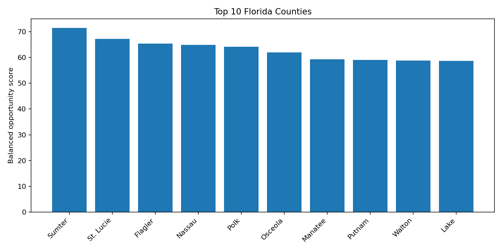
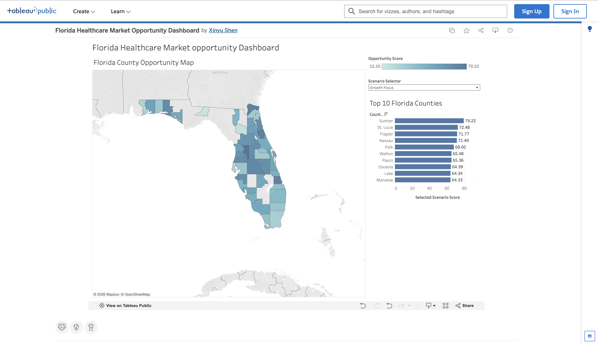

# Florida Healthcare Market Opportunity Analysis

A portfolio project that screens Florida's 67 counties for further outpatient-clinic market research using Python, SQL, scenario scoring, and interactive dashboards built with Streamlit, Plotly, and Tableau.

> **Important:** This is a transparent market-screening exercise, not a complete site-selection study or profitability forecast.

## Business Question

Based on population growth, healthcare need, primary-care supply, and local economic context, which Florida counties should be prioritized for deeper market research?

## Main Result

Under the Balanced scenario, the top three eligible counties are **Sumter, St. Lucie, and Flagler**. Six counties—**Sumter, St. Lucie, Flagler, Polk, Osceola, and Lake**—remain in the Top 10 under all three scenarios, making them the strongest candidates for follow-up analysis.



## Interactive Tableau Dashboard

Explore the interactive dashboard to compare Florida counties across three market-opportunity scenarios:

- Balanced
- Healthcare Need Focus
- Growth Focus

**[View the interactive Tableau dashboard →](粘贴你的Tableau Public链接)**



## Skills Demonstrated

- Python data cleaning, joins, KPI engineering, validation, and reproducible pipelines
- SQL data-quality checks, CTEs, CASE logic, aggregation, median comparisons, and window-function ranking
- Transparent percentile scoring and three-scenario sensitivity analysis
- Executive dashboard development using Tableau, Streamlit, and Plotly
- Executive recommendations and limitations written for a non-technical audience

## Data

The project uses the official **2025 and 2024 County Health Rankings Florida Data** workbooks. Those workbooks compile underlying measures from the Census Population Estimates Program, BRFSS, AHRF/AMA, CMS NPI, and related public sources.

Core metrics:

1. Population, used for context and a 50,000-person eligibility screen
2. 2022–2023 population growth
3. Population age 65+
4. Diagnosed diabetes prevalence
5. Primary-care physicians per 10,000
6. Other primary-care providers per 10,000
7. Median household income

The initial plan used hospital facility counts. That metric was replaced with other primary-care-provider supply because it offered a cleaner and more consistent county-level access measure within the selected source.

## Scenarios

| Scenario | Emphasis |
|---|---|
| Balanced | Growth, need, provider gaps, and income |
| Healthcare Need Focus | Age, diabetes, and provider shortages |
| Growth Focus | Recent population growth |

All scored metrics are converted to county percentiles. Provider-supply percentiles are reversed so lower supply produces a higher potential-opportunity score.

## Project Structure

```text
├── data/raw/                 # Original CHR workbooks
├── data/processed/           # Analysis CSVs and SQLite database
├── src/data_pipeline.py      # Build county-level dataset
├── src/scoring.py            # Percentile scores and scenarios
├── src/build_database.py     # Load processed data into SQLite
├── sql/                      # Quality, KPI, and ranking queries
├── dashboard/app.py          # Streamlit dashboard
├── outputs/                  # Quality report and figures
├── reports/                  # Executive summary and recruiting materials
└── tests/                    # Scoring test
```

## Run Locally

```bash
python -m venv .venv
source .venv/bin/activate        # Windows: .venv\Scripts\activate
pip install -r requirements.txt

python src/data_pipeline.py
python src/scoring.py
python src/build_database.py
pytest -q
streamlit run dashboard/app.py
```

## Key Findings

- Sumter combines very fast growth, a uniquely high 65+ share, constrained provider supply, and relatively strong household income.
- St. Lucie combines fast growth, high diabetes prevalence, an older population, and low PCP supply.
- Flagler combines growth and older-adult demand with low physician and other-primary-care-provider supply.
- Polk and Osceola offer much larger population scale and high diabetes prevalence, making them important alternatives even though they do not rank in the Balanced Top 3.

See [the executive summary](reports/executive_summary.md) for the recommendation and [limitations](reports/limitations.md) for what the model does not cover.

## Limitations

This analysis excludes sub-county variation, competitor capacity, appointment availability, payer mix, reimbursement, staffing costs, real estate, patient travel patterns, licensing, capital requirements, projected revenue, and profitability. The weights are analyst-selected assumptions, not validated causal or financial estimates.

## Portfolio Materials

- [Executive summary](reports/executive_summary.md)
- [Resume bullets](reports/resume_bullets.md)
- [Two-minute interview pitch](reports/interview_pitch.md)
- [Data dictionary](data/data_dictionary.md)
